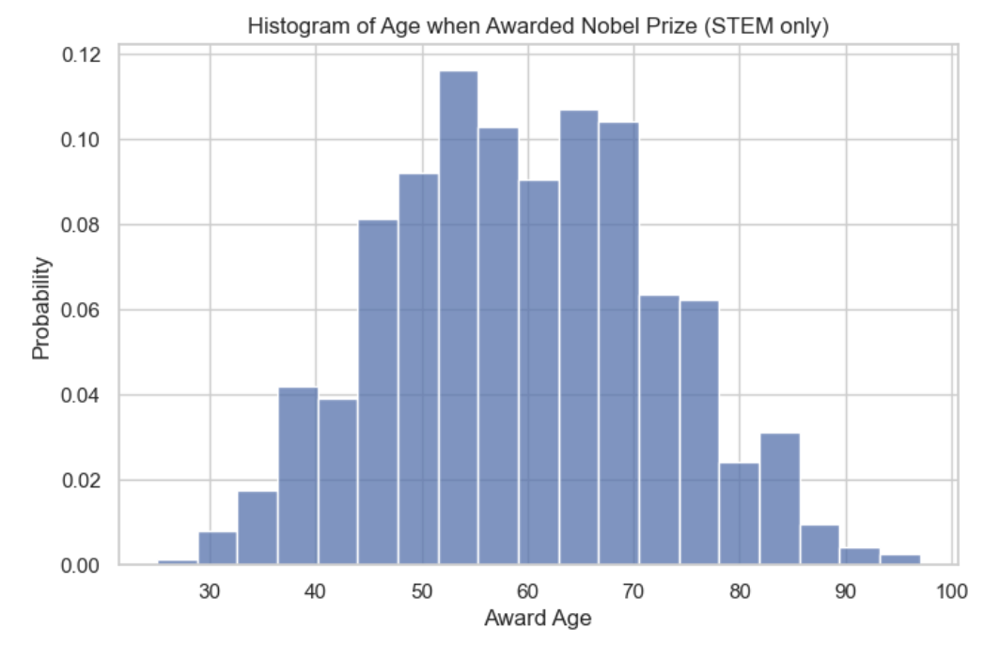
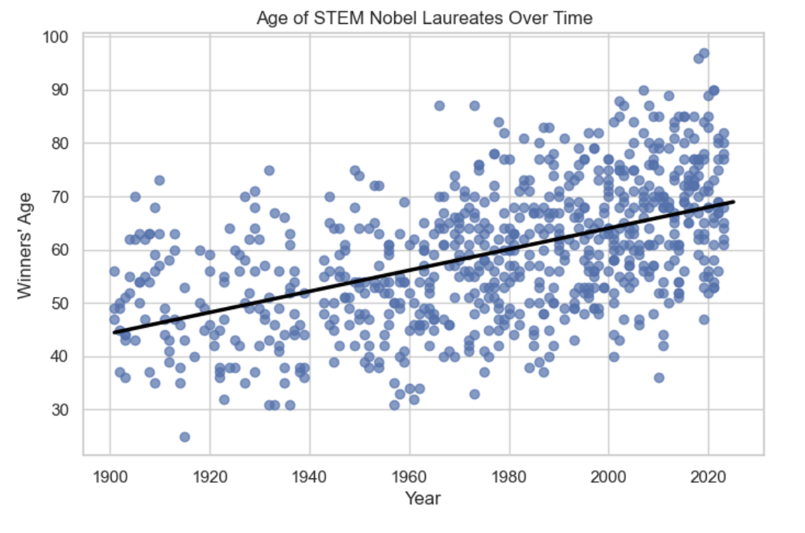
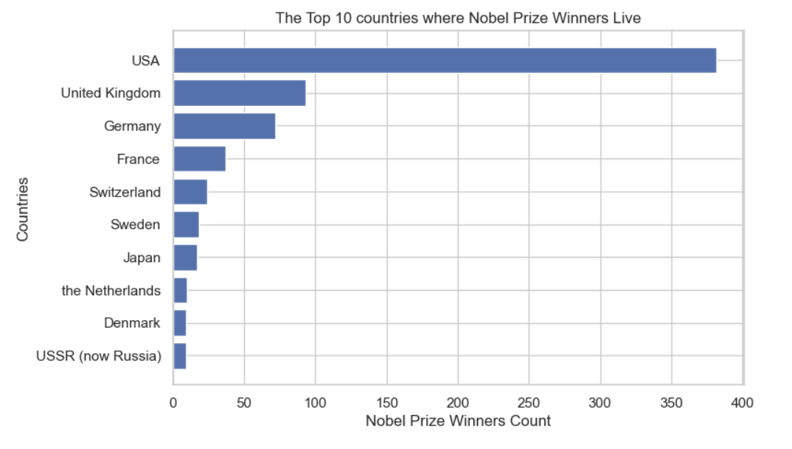
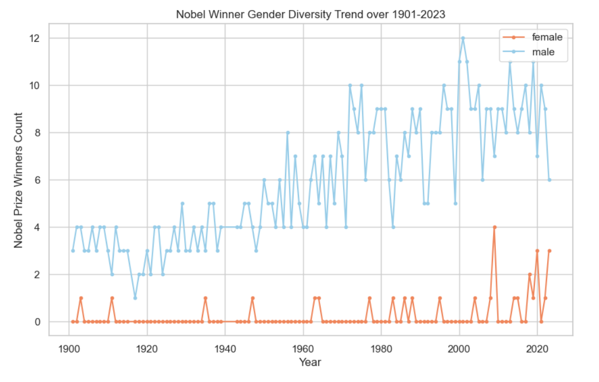
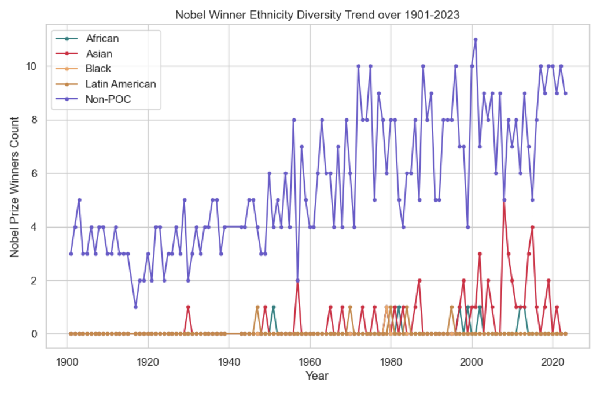
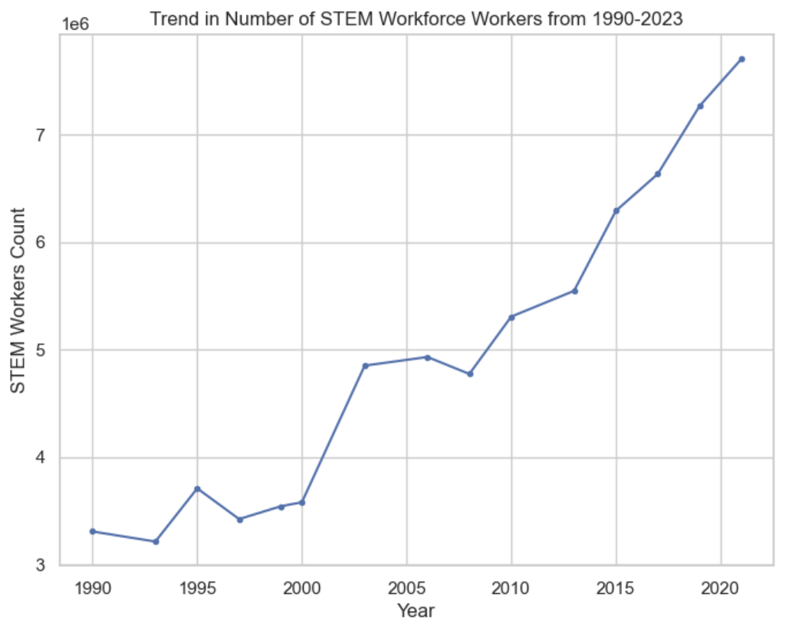
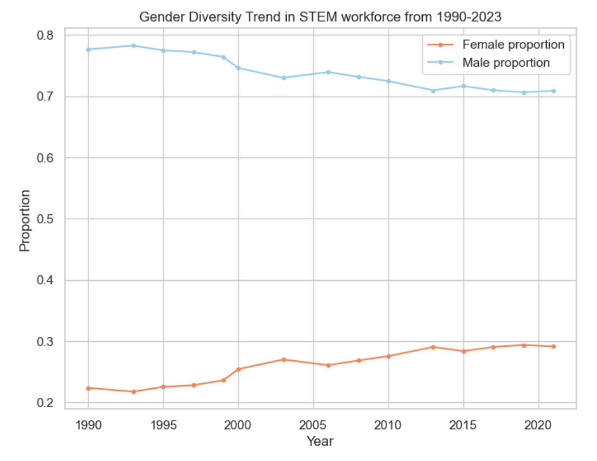
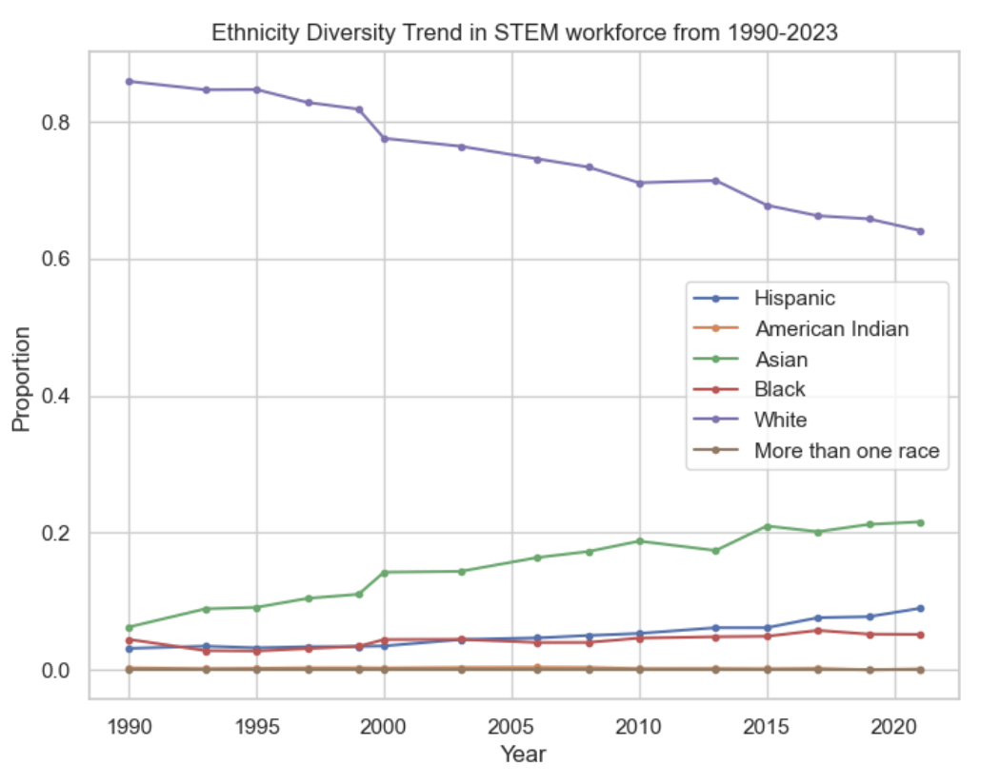
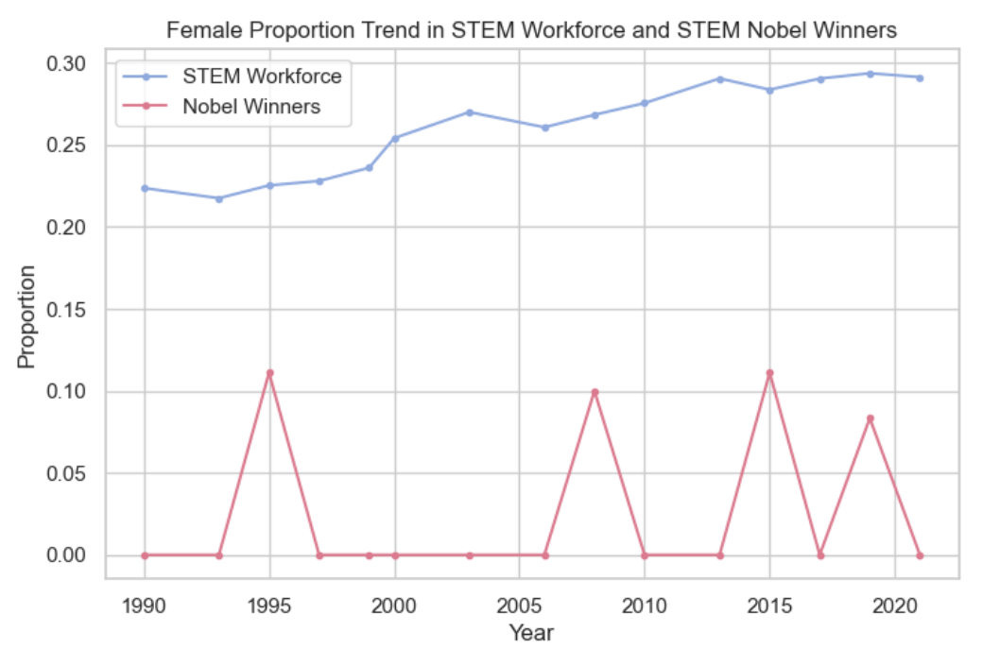
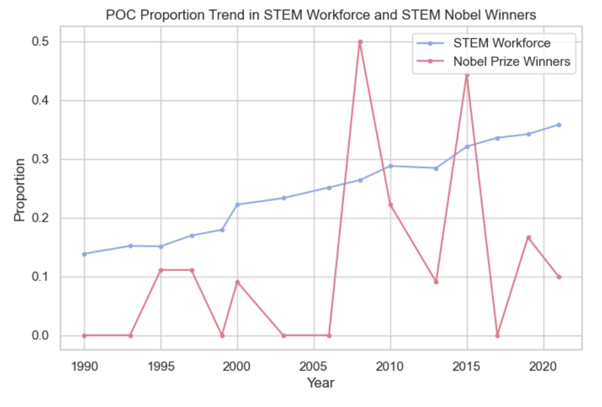

<!-- # Diversity Trends of STEM Nobel Prize Winners and STEM Workforce Over Time -->

## Overview
This is the project repository for COGS108 at UCSD in WI24. It encompasses a comprehensive analysis aiming to uncover trends in diversity within the STEM fields, specifically comparing Nobel Prize laureates to the broader workforce from 1990 to 2023. Inside, you will find datasets, analytical scripts, and results that aim to enhance our understanding of the evolution of diversity among Nobel Prize laureates and STEM professionals. This project utilizes statistical methods, such as chi-squared tests and correlational analysis, to investigate the representation of women and People of Color (POC) within these prestigious circles. Detailed documentation is provided to guide you through each component of the project, from data collection and preprocessing to in-depth analysis and interpretation of the findings. The link to our final report can be found <a href="https://github.com/COGS108/Group038_WI24/blob/master/FinalProject_Group038_WI24.ipynb">here</a>.

## 1. Abstract
The Nobel Prize is one of the highest achievements one can receive in the academic field — however, it is no secret that the pool of laureates lacks diversity, despite our society being the complete opposite. Similarly, STEM has been a field historically dominated by white males, though recent efforts and initiatives to make the space more inclusive have become more prevalent. Consequently, we sought to compare both the workforce and Nobel laureates in the STEM fields to see if there was a trend toward more diversity for women and/or People of Color (POC) from 1990 to 2023. After comparing the proportions of gender and ethnicities, conducting the chi-squared test, and completing a correlational analysis, we conclude that there is no significant difference between Nobel Prize laureates and workforce diversity found. This is likely due to the small sample size for Nobel Prize winners and some missing demographic data. Future work could be conducted with Nobel Prize nominees, which would have a larger sample size to achieve potentially clearer and more informative results.

## 2. Research Question
Is there a trend toward more diversity for women and people of color in the workforce compared to Nobel laureates in the STEM fields from 1990 to 2023?

## 3. Background and Prior Work
The Nobel Prize is one of the most established and well-known awards in the scientific field. Since 1901, the Nobel Prize has been awarded 621 times to accomplished people in Physics, Chemistry, Medicine or Physiology, Literature, Peace, and Economic Sciences. [1](#cite_note-1) However, in recent years, there have been many controversies in the pool of nominations and laureates of the Nobel Prize regarding the majority white, male-dominated nature of elite education and research institutes. Till 2018, only 20 out of 607 medals were awarded to women. [2](#cite_note-2) Neikirk et al. focused on winners in the Physiology and Medicine category and classified them on nationality, gender, and race. The research shows that the nationalities of the majority of the laureates are American. Moreover, black scientists are significantly underrepresented and there is an apparent lack of gender and racial minorities among Nobel laureates. [3](#cite_note-3) 

Furthermore, a study from 2017 analyzed the institution affiliations of the winners (ie. where they received their Ph.D/MD degree and conducted a majority of their research). It demonstrates that Nobel laureates are primarily associated with elite education and research institutes. [4](#cite_note-4) This is significant since a disproportionate number of minorities are often underrepresented in higher education.

Both studies suggest bias toward scientists based on their nationality, gender, race, and associated institution. In our study, we aim to analyze the diversity of Nobel laureates similarly to Neikirk et al. However, differing from their study, we include other categories besides just Physiology and Medicine that would fall under the STEM label. We expanded the scope further by also comparing the diversity trends of Nobel prize winners to the actual STEM workforce. This will allow us to get a more accurate understanding of the current state of diversity in both academia and industry.

In 2019, the Nobel Prize committee addressed the lack of diversity by announcing that they would try to expand the pool of nominees in gender, ethnicity, and geography. The academy’s secretary-general, biomedical scientist Göran Hansson, said: “It looks like there is a positive trend, with more women being nominated. It’s small, but it’s a trend… With time, there will also be a gradual change in the population of scientists who are potential candidates, so that will help too.” [2](#cite_note-2) 

Hansson’s opinion is echoed in Mahmoudi et al.’s research. They calculated the likelihood of women winning the Nobel Prize over the years. The results illustrate that there is an overall increase in the percentage of female winners in all categories except Physics. This trend could be related to the rise in women participating in the STEM fields. Based on reports from the National Science Foundation, between 2011 and 2021, there was a significant increase in the representation of women and underrepresented minorities in the STEM workforce in the United States. [6](#cite_note-6) However, the proportion of women in the workforce is still more significant than the percentage of women in Nobel laureates. [5](#cite_note-5)

While there is evidence that the gender disparity is decreasing, the issue of minority representation is still prevalent. Namely, the research does not address POC, which we strive to do in our project. We also want to compare POC representation in the Nobel Prize with the workforce to see if there is a trend similar to women in STEM.

**References**

1.  “Nobel Prize facts.” NobelPrize.org, 5 Oct. 2009, https://www.nobelprize.org/prizes/facts/nobel-prize-facts.
2.  Gibney, Elizabeth. “'More women are being nominated': Nobel academy head discusses diversity.” Nature, 4 Oct. 2019, https://doi.org/10.1038/d41586-019-02988-5.
3.  Neikirk, Kit, et al. “Disparities in funding for Nobel prize awards in medicine and physiology across nationalities, races, and gender.” Journal of Cellular Physiology, 15 Jan. 2024, https://doi.org/10.1002/jcp.31157.
4.  Schlagberger, Elisabeth Maria, et al. “United States, Europe, and Asia: Diversity in Nobel Prize-Winning Affiliations”. International Higher Education, no. 90, June 2017, pp. 12-13, doi:10.6017/ihe.2017.90.10004.
5.  "Mahmoudi, Morteza, et al. “Representation of women among scientific Nobel prize nominees.” The Lancet, vol. 394, no. 10212, Nov. 2019, pp. 1905-1906, https://doi.org/10.1016/s0140-6736(19)32538-3.
6.  "Diversity and STEM: Women, Minorities, and Persons with Disabilities in Science and Engineering: 2023." National Center for Science and Engineering Statistics (NCSES), National Science Foundation, 2023, https://ncses.nsf.gov/pubs/nsf23315/report.

## 4. Hypothesis
We predict that while the demographic of Nobel Prize winners will be diversified from 1990 to 2023 and reflect gradual changes in academia and research fields, this trend may lag behind the broader diversification observed within the general workforce, particularly regarding gender, ethnicity, and nationality. This discrepancy can be attributed to the inherently conservative nature of academic recognition as well as the time lag in acknowledging diverse contributions within the upper echelons of academia compared to more rapid shifts in workforce demographics driven by global trends, policy changes, and inclusivity efforts.

## 5. Data

Detailed data descriptions and data cleaning process can be found in the <a href="https://github.com/COGS108/Group038_WI24/blob/master/FinalProject_Group038_WI24.ipynb">final report</a>.

### 5.1 Data overview

For each dataset include the following information
- Dataset #1
  - Dataset Name: `nobel_prize_ethnicity`
  - Link to the dataset: <a href="https://en.wikipedia.org/wiki/Lists_of_Nobel_laureates">original data source</a>, <a href='https://github.com/COGS108/Group038_WI24/blob/master/nobel_data_identity.csv'>github link</a>
  - Number of observations: 144
  - Number of variables: 4
- Dataset #2 
  - Dataset Name: `nobel_prize_winners`
  - Link to the dataset:  <a href="https://public.opendatasoft.com/explore/dataset/nobel-prize-laureates/table/?flg=en-us&disjunctive.category">original data source</a>, <a href='https://github.com/COGS108/Group038_WI24/blame/master/nobel_winners.csv'>github link</a>
  - Number of observations: 1000
  - Number of variables: 13
- Dataset #3 
  - Dataset Name: `stem_workforce_ethnicity`, `stem_workforce_gender`
  - Link to the dataset: <a href="https://www.nsf.gov/statistics/women/">original data source</a>, <a href='https://github.com/COGS108/Group038_WI24/blob/master/STEM_Workforce_Ethnicity.csv'>github link for ethnicity</a>, <a href='https://github.com/COGS108/Group038_WI24/blob/master/STEM_Workforce_Gender.csv'>github link for gender</a>
  - Number of observations: 107 each
  - Number of variables: 8 (`stem_workforce_ethnicity`), 4 (`stem_workforce_gender`)

### 5.2 Data Cleaning

**Dataset #1**: `nobel_prize_ethnicity`
- Keep necessary information: drop the non-STEM Nobel categories.
- String standardization: clean strings for uniformity, replace special characters.

**Dataset #2**: `nobel_prize_winners`
- Keep necessary information: drop the non-STEM Nobel categories.
- String standardization: clean strings for uniformity, extract country names.

**Merge Dataset #1 and #2**: `final_nobel_prize`
- Merge by year and prize category.
- Filter the resulting dataset by matches in names to ensure accuracy.
- Drop duplicates to avoid conflicts.

**Dataset #3**: `stem_workforce`
- Convert data type: change strings into integers.
- String standardization: clean the category column, aggregate similar categories together for uniformity.
- Calculate percentage: add percentages to the dataset in addition to numbers.

## 6. Exploratory Data Analysis (EDA)

### 6.1 Nobel Prize Winner dataset `final_nobel_prize`

**Basic Information**
- Missing values: there are no missing values since we've filled in the NaN values in `identity` with Non-POC.
- Winner gender distribution: There are 710 males, 29 females in the cleaned final dataset.
- Winner ethnicity distribution: There are 675 Non-POC, 50 Asian, 8 African, 5 Latin American, and 1 Black Nobel winners in the cleaned final dataset.
- Unique categories: the STEM Nobel categories kept are "physics", "chemistry", "medicine" and "economics".

**Ages of Nobel Prize Winners at the Time of Award**
- Oldest and youngest winner: The oldest winner identified was John Goodenough, who was awarded Nobel Prize when he was 97. The youngest winner identified was Lawrence Bragg, who was awarded Nobel Prize when he was 25.
- Distribution of Award Ages:

  
   
  <em>Figure 1: Histogram of STEM Nobel Winners' Ages when awarded the prize. It seems to be a normal distribution.</em>

- Year vs. Award Ages:

  
   
  <em>Figure 2: Scatterplot of Winning Year vs. STEM Nobel Winners' Ages when awarded the prize. An OLS regression line was plotted, indicating that winners tend to be older as year goes by.</em>

**Countries with the Most STEM Nobel Winners**

The United States stands as the leading country with the highest number of STEM Nobel laureates, boasting 382 winners. The United Kingdom follows as the second most prolific, with 93 laureates, and Germany ranks third, home to 72 Nobel winners in the STEM fields.

  
   
  <em>Figure 3: Bar chart of the top 10 countries with most Nobel Prize winners.</em>

**1901-2023 Gender and Ethnicity Distribution of STEM Nobel Winners**

- Gender Distribution: STEM Nobel Prize is mainly dominated by male winners, though the number of female winners increased substantially from 2000 onward.

  
   
  <em>Figure 4: Nobel Winner Gender Diversity Trend over 1901-2023.</em>

- Ethnicity Distribution: Across 1901-2023, Non-POC makes up the majority of Nobel Prize winners. While there are some variations of increases and decreases, they are consistently higher than the other ethnicities. 

  
   
  <em>Figure 5: Nobel Winner Ethnicity Diversity Trend over 1901-2023.</em>

### 6.2 STEM Workforce dataset `final_stem_workforce`

**Growth in the STEM Workforce**

The popularity of STEM as a field increases between 1990 and 2023 from 3,304,800 to 7,709,000 workers. There are a couple of years where there are dips such as 1997, and 2007, but overall saw an increase of 133.27%. 

  
   
  <em>Figure 6: Trend in Number of STEM Workforce Workers from 1990-2023.</em>

**1990-2023 Gender and Ethnicity Distribution of the STEM Workforce**

- Gender Distribution: The percentage of males goes down from ~80% to ~70% and the percent of femalse goes from ~21% to 30% during 1990-2023. This demonstrates a general treand of increase in female representation in STEM workforce. 

  
   
  <em>Figure 7: Line chart of Year vs. Proportion of each gender group from 1990 to 2023.</em>

- Ethnicity Distribution: There is a slight increase in Black and Hispanic percent. Asian percent increase significantly, reflecting the same trends as the Nobel Prize winner data. Again, we see that the White/non-POC percent is still the majority, though it decreased significantly in conjunction. 

  
   
  <em>Figure 8: Line chart of Year vs. Proportion of each ethnicity group from 1990 to 2023.</em>

 

## 7. Analysis of Diversity Trends

### 7.1 Comparison by Visualizations

- Gender Diversity Comparison: The proportion of females making up the STEM fields in the workforce is much higher than the Nobel Prize winners. The workforce line shows an upward trend, while the female representation in STEM Nobel Prizes fluctuates, with no identifiable trend.

  
   
  <em>Figure 9: Line chart of Year vs. Female Proportion in the two populations from 1990 to 2023.</em>

 

- Ethnicity Diversity Comparison: There is a slow but steady upward trend of POC representation in the STEM workforce, while it is much more volatile in Nobel Prize winners. There are steep fluctuations, most likely because of the small sample size. However, it looks like POC representation has dropped off after 2015 and is consistently lower than the workforce till 2023.

  
   
  <em>Figure 9: Line chart of Year vs. POC Proportion in the two populations from 1990 to 2023.</em>

 

### 7.2 Chi-Squared Test

#### 7.2.1 Methods

The Chi-squared test is a statistical method used to evaluate the differences between categorical distributions. The null hypothesis for this testing posits that there is no significant difference between the two distributions being compared in each focal year. This means, for example, that the proportions of different genders or ethnicities within the workforce would be expected to remain consistent across the years examined, barring any statistically significant deviations detected by the test.

We have prepared data as contingency tables that display the frequency distribution of variables. Then, we conduct Chi-Squared test for each year between the gender and ethnicity distribution of the STEM workforce population and the STEM Nobel Winners population.

#### 7.2.2 Results

We've discovered a significant difference in ethnicity distribution between the two populations in 2008. Other than that, our analysis lacks sufficient evidence to reject the null hypothesis – meaning, there is no statistical difference between the diversity trends of the STEM workforce and the STEM Nobel Prize winners. It appears that the diversity trends within Nobel laureates generally mirror those observed in the STEM workforce.

### 7.3 Correlation Analysis

#### 7.3.1 Methods

In this part, we aim to investigate the potential correlation between the gender and ethnic composition of the STEM workforce and of the Nobel Prize laureates in the focal years using Pearson correlation coefficient. Applying this coefficient in our analysis will provide insights into how closely the trends in STEM workforce diversity align with those in Nobel Prize winner demographics.

We have prepared data by calculating the percentage of each gender and ethnicity group in both distributions and aggregate them into one dataset. Then we calculate the Pearson correlation coefficient for each group.

#### 7.3.2 Results

Key observations from our analysis include:

- Asian: With a coefficient of 0.4918, we observe a moderate positive correlation. This suggests a tendency for the proportion of Asian Nobel Prize winners to increase alongside an increase in their representation within the STEM workforce. Although the correlation is moderate, it indicates a notable relationship.

- Black: The result of "nan" (not a number) for Black Nobel Prize winners arises from insufficient data to establish a correlation, mainly due to the absence of Black Nobel laureates in the selected years. This limitation prevents us from computing a meaningful correlation.

- Gender: The analysis shows a very weak positive correlation for both females and males. This indicates a minimal linear relationship between an increase in the gender representation within the STEM workforce and their proportion among Nobel Prize winners. Such findings suggest that the transition from workforce representation to Nobel Prize recognition may be influenced by factors beyond mere numerical representation.

The absence of significant results in some categories can be attributed to the small sample size of Nobel Prize winners in the STEM fields. The Nobel Prize is awarded to only a few individuals each year, leading to zero values in some categories and thereby limiting the scope for establishing robust correlations.

## 8. Conclusion & Discussion

While previous studies have addressed various aspects of the lack of diversity of the Nobel Prize laureates, the current literature lacks a holistic overview of POC representation in the pool of winners. Our research aims to investigate the trend toward diversity for women and POC in the workforce compared to Nobel laureates in the STEM fields from 1990 to 2023. We predicted that there would be diversification among Nobel Prize winners, but might not align with the more rapid changes observed in the broader STEM workforce.\

From the Nobel Prize winner dataset, we saw that males and non-POC were overwhelmingly represented, with females and Asians showing the most increase throughout the years. The same was found in the STEM workforce dataset, including a slight increase in female and Asian representation. When comparing the two datasets together, the Nobel Prize winners had a lower percentage of women; the highest percentage never exceeded 15%, as opposed to the workforce, where it approached 30% in recent years. In terms of ethnicity, comparing the two datasets revealed more extreme fluctuations in POC representation in the Nobel Prize winners. This even surpassed the workforce percentage in certain years. However, we found POC representation in the STEM workforce to steadily increase throughout 1990-2023.\

To further support the graphical comparisons, we conducted a chi-square test and correlation analysis. The chi-square showed that besides 2008, there were no statistically significant variations in gender or ethnicity distribution between the two datasets. From the correlation analysis, we observed a moderate positive correlation for Asian representation, suggesting that there is a tendency for Asian Nobel Prize winners to increase alongside the STEM workforce. There was insufficient data to establish a correlation for Black representation, due to the absence of Black Nobel Prize winners during some years.\

Overall, there is not enough evidence to reject the null hypothesis and it is difficult to determine whether or not the diversity trends of Nobel Prize winners in STEM categories reflect the STEM workforce. We are limited by the small sample size of Nobel Prize winners in the STEM fields and potentially incomplete demographic data of the STEM workforce. There were Pacific Islanders, Native Americans, and other identities not fully captured in our dataset and our resulting analysis. In the future, others may attempt to conduct a similar study with Nobel nominees for a larger sample size and more informative results. Another direction could be to focus on specific fields to the corresponding Nobel Prize category to look into diversity trends for subjects like physics, economics, etc. Future studies should focus on bigger datasets for clearer trends, with more thorough and accurate information on POC demographics. While we were unable to find definite conclusions, we expanded on previous research that only focused on the distribution of gender among Nobel Prize winners. We have shown a comparison of diversity trends between Nobel Prize laureates and the workforce in STEM fields, including gender and ethnicity, which broadens the scope of discussion on this topic.

## 9. Ethics & Privacy

The proposed Nobel Prize winner dataset is based on open-access information about Nobel Prize winners. Given that Nobel Prize winners are well-documented public figures, their information is accessible online. Similarly, the workforce data is also publicly available and doesn't include any sensitive information. Thus, there should not be any privacy concerns.

While the Nobel Prize dataset is inherently unbiased as it only contains the facts about the winners, the STEM workforce data could introduce bias. The bias may arise during the sampling process, which can be limited in some segments of the workforce, lacking diversity in job roles and focusing on specific geographical locations. To mitigate the biases and increase the reliability of our findings, we aim to search for comprehensive STEM-related data collected by governmental agencies, such as the U.S. Department of Labor, that is representative of the workforce.

After inspecting our data, certain individuals whom we gathered data from Wikipedia are Africans born and raised but are not necessarily identified as people of color (POC). This includes individuals like Max Theiler, who, despite being born in Africa, had Swiss-born parents and identified as white, and others with European or American backgrounds. This meticulous verification process underscores our commitment to precise and respectful representation in our dataset. Our goal was to reflect a more nuanced understanding of racial and ethnic identities, particularly in a diverse and complex continent like Africa.

We also wanted to acknowledge that there might be people who would be of more than one race, American Indian, or Pacific Islander who might not be included due to the lack of data available for the STEM workforce gathered in the National Science Foundation. In addition, the STEM Nobel Prize winner also lacked representation for people with more than one race, American Indians, and Pacific Islanders, so we decided to drop off earlier data to make clearer comparisons. Moreover, the gender representation in both datasets is only binary, excluding people with non-binary gender identities, which we hope for a change to a more inclusive collection of demographic data.

Although our conclusion doesn’t prove whether or not STEM Nobel Prize winners reflect the STEM workforce, this is mainly because the Nobel Prize is a prestigious award. This would mean that the winners are limited, but the STEM workforce will continue to grow due to population increase. Therefore, this is not a representation of women and POC who are a part of the STEM workforce and Nobel Prize winners and should not be used to judge other women and POC in STEM.

## 10. Team Contributions

- **Anh Tran**: Background research, data collecting, forming descriptions, editing graphs, ethics and privacy, slides and video creation.
- **Jodi Roe**: Background research and write up for introduction, data visualization descriptions, proofreading and editing coding descriptions, abstract, conclusion/discussion, final slides editing
- **Tianyu Wang**: Background write-up, data collection of STEM workforce, editing coding and graph descriptions, slides, video
- **Wan-Hsuan Lin**: Background research for introduction, data collection, wrangling, visualizations, and descriptions, video slides and voice recording.
- **Xiaoyu Gui**: Research question, hypothesis and team timeline, data collection of Nobel Prize Winners, data merging and cleaning, visualizations, analysis code and descriptions.
